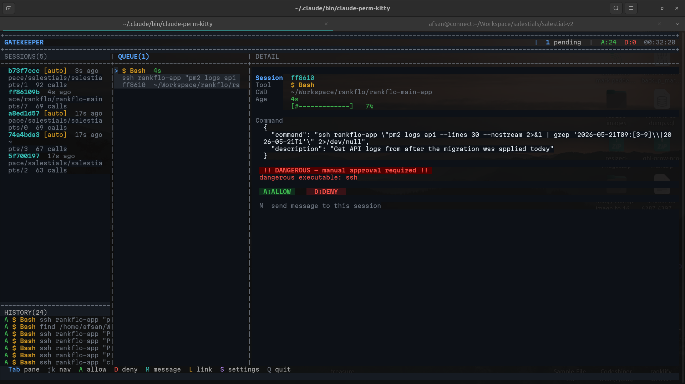

# Gatekeeper

**One terminal to rule all your Claude Code sessions.**

When you run multiple Claude Code sessions across terminals or IDE windows, each one asks for permission in its own terminal. Gatekeeper intercepts every request and routes them to a single dashboard — you approve, deny, or auto-approve without switching windows.


---

## What it looks like



**Left pane** — all active Claude sessions with status badges (`[auto]` = auto-approve enabled)  
**Middle pane** — pending permission requests with age timer  
**Right pane** — full request detail, danger warnings, and a numbered approval menu

---

## Features

- **Unified approval terminal** — all Claude sessions route here regardless of where they run
- **Claude Code-style numbered menu** — `1` allow once, `2` always allow (saves rule), `3` deny; `↑`/`↓` to move cursor, `Enter` to confirm
- **Persistent allow (option 2)** — saves a rule to Gatekeeper config so the command skips the queue next time
- **Sessions shown immediately** — reads `~/.claude/sessions/` on startup, no waiting for a hook call
- **Auto-approve per session** — mark trusted sessions to silently pass routine tool calls
- **Hard safety rules** — `rm`, `ssh`, `sudo`, `--force`, SQL mutations, writes to `/etc/` always require manual approval, even on auto sessions
- **Sole permission gate** — `bypassPermissions` mode disables Claude Code's own dialogs; Gatekeeper is the only checkpoint
- **Message injection** — type a message in Gatekeeper and it appears in the target Claude terminal as keyboard input
- **Window linking** — link each session to its terminal tab so messages go to exactly the right window
- **Daily logs + stats** — every decision is recorded; `gatekeeper stats` shows rates by day and session
- **Terminal fallback** — if Gatekeeper is not running, a `Y/n` prompt appears in the Claude terminal so nothing hangs

---

## Requirements

- **Linux** with X11 (`echo $DISPLAY` should show `:0` or similar)
- **Python 3.11+**
- **Claude Code CLI**
- Any X11 terminal emulator (gnome-terminal, Kitty, Alacritty, etc.)

---

## Installation

```bash
git clone https://github.com/Btocode/gatekeeper
cd gatekeeper
python3 -m venv .venv
source .venv/bin/activate
pip install -r requirements.txt
bash install.sh
```

`install.sh` does four things:

1. Installs wrapper scripts in `~/.claude/bin/`
2. Registers a `PreToolUse` hook in `~/.claude/settings.json` — Claude Code calls this before every tool use
3. Adds blanket `permissions.allow` rules (`Bash(**)`, `Read(**)`, `Write(**)`, `Edit(**)`, …) using `**` to match path separators
4. Sets `permissions.defaultMode = "bypassPermissions"` — disables Claude Code's built-in permission dialogs entirely so Gatekeeper is the sole approval gate (Claude Code's hardcoded sensitive-path prompts for `/proc/`, `/sys/`, `~/.bashrc`, etc. only suppress in this mode)

---

## Usage

Open a dedicated terminal and run:

```bash
gatekeeper
```

Start your Claude Code sessions anywhere — other terminals, VS Code, JetBrains, anywhere. Every `Bash`, `Edit`, `Write`, or `Agent` call will appear in Gatekeeper.

### Approving from the Claude terminal instead of Gatekeeper

By default the hook waits up to **5 minutes** for Gatekeeper to respond, then falls back to a `Y/n` prompt directly in the Claude terminal. This means:

| Situation | What happens |
|-----------|-------------|
| Gatekeeper running | Request appears in dashboard — approve with `A` / `D` |
| Gatekeeper not running | `[Permission required] Y/n` prompt appears in Claude terminal |
| Gatekeeper running, no response in 5 min | Hook times out, falls back to `Y/n` in Claude terminal |

**To approve from the Claude terminal immediately** (skip Gatekeeper for a session):

```bash
# Set timeout to 0 — always use terminal prompt, ignore daemon
GATEKEEPER_TIMEOUT=0 claude

# Or set a short timeout (e.g. 10 seconds)
GATEKEEPER_TIMEOUT=10 claude
```

**To permanently prefer terminal prompts**, add to `~/.zshrc`:

```bash
export GATEKEEPER_TIMEOUT=0
```

**To stop Gatekeeper entirely**, press `Q` in the dashboard — subsequent hook calls fall back to the terminal prompt automatically.

---

## Keyboard shortcuts

| Key | Pane | Action |
|-----|------|--------|
| `Tab` | any | Switch focus between Sessions and Queue |
| `j` / `k` | any | Navigate queue items or sessions |
| `↑` / `↓` | Queue | Move the approval cursor (1 / 2 / 3) |
| `1` | Queue | Never — deny this request |
| `2` | Queue | Yes forever — saves rule to config + Claude Code allowlist |
| `3` | Queue | Yes, for this session only — allows without saving permanently |
| `Enter` | Queue | Confirm highlighted option |
| `A` | Queue | Yes, for this session only (shortcut) |
| `D` | Queue | Never / deny (shortcut) |
| `A` | Sessions | Toggle auto-approve for the selected session |
| `M` | any | Send a message to the selected session |
| `L` | Sessions | Link the session to a terminal window |
| `U` | Sessions | Unlink the session from its terminal window |
| `S` | any | Open settings (tool types, bash categories, custom patterns) |
| `Q` | any | Quit |

---

## Auto-approve

Mark a session (`A` in the Sessions pane) to silently allow all its tool calls. The session shows `[auto]` — you only see requests that need your attention.

### What auto-approve never skips

No matter what, these always require manual approval:

| Category | What's blocked |
|----------|----------------|
| File deletion | `rm`, `rmdir`, `shred` |
| Remote access | `ssh`, `scp`, `rsync`, `sftp` |
| Privilege escalation | `sudo`, `su` |
| Service control | `systemctl stop/disable`, `service stop` |
| Containers | `docker rm/kill/prune`, `kubectl delete` |
| Infrastructure | `terraform apply/destroy` |
| Destructive git | `push --force`, `reset --hard`, `clean -f` |
| Sensitive paths | Writes to `/etc/`, `/usr/`, `~/.ssh/`, `~/.aws/` |
| Disk ops | `dd`, `mkfs`, `fdisk` |

Read-only commands — `grep`, `find`, `ls`, `cat`, `git status`, `npm install`, `SELECT` queries — always pass through auto-approve freely.

---

## Session linking

Linking maps a Claude session to its terminal window so the `M` (message) key knows exactly where to send input.

1. `Tab` to the Sessions pane, navigate to a session
2. Press `L` — an overlay appears
3. Switch to the Claude terminal tab (alt+tab, click, etc.)
4. Gatekeeper detects the focus change and links automatically — session shows `[linked]`

Links persist in `~/.claude/perm-window-map.json`.

---

## Sending messages

Press `M`, type your message, press `Enter`. Gatekeeper injects the text into the linked Claude terminal using X11 XTEST — it appears **and submits automatically**, exactly as if you typed it and pressed Enter there. No need to switch to that terminal.

Useful for:
- Answering Claude's mid-task questions (`A / B / C?`) without switching windows
- Explaining why you denied a request
- Redirecting Claude to a different approach while it waits

Requires the session to be linked first (`L` key).

### Tabs vs windows

Message injection works when each Claude session runs in its own terminal **window**. If multiple sessions share one window as **tabs**, all tabs have the same X11 window ID — Gatekeeper cannot distinguish between them.

| Setup | Message injection |
|-------|-------------------|
| Each session in its own window | ✅ Works |
| Sessions as tabs in one window | ❌ Cannot target specific tab |

**Workaround:** open each Claude session in a new terminal window instead of a new tab (`kitty`, `gnome-terminal --window`, etc.).

---

## Stats

```bash
gatekeeper stats          # today
gatekeeper stats 7        # last 7 days
gatekeeper stats all      # all time
```

```
====================================================
 GATEKEEPER STATS
====================================================
  Total decisions : 177
  Auto-approved   :   16  (  9%)
  Manual reviewed :  161  ( 90%)
    allowed       :  161
    denied        :    0

  Auto-approved by session:
    b73f7ccc    7 calls
    a8ed1d57    5 calls

  Auto-approved by tool:
    Bash             11
    Edit              5
====================================================
```

Logs live in `~/.claude/perm-logs/YYYY-MM-DD.log`, one file per day, kept indefinitely.

---

## How it works

```
  Claude session A         Claude session B         Claude session C
  (any terminal/IDE)       (any terminal/IDE)       (any terminal/IDE)
        │                        │                        │
  PreToolUse hook          PreToolUse hook          PreToolUse hook
  (blocks Claude)          (blocks Claude)          (blocks Claude)
        └────────────────────────┼────────────────────────┘
                                 │  Unix socket
                                 ▼
                    ┌────── Gatekeeper daemon ──────┐
                    │   blessed TUI                 │
                    │   asyncio socket server       │
                    │   session registry            │
                    └───────────────────────────────┘
                             (your terminal)
```

A `PreToolUse` hook fires before every tool call in every Claude session. It connects to Gatekeeper's Unix socket at `/tmp/claude-perm-$USER.sock`, sends the request, and waits. Gatekeeper shows the request in the UI. When you press `A` or `D`, the decision travels back through the socket — Claude proceeds or stops.

Sessions are discovered at startup by reading `~/.claude/sessions/*.json` (the same files used by `claude /resume`), so all running sessions appear immediately.

If Gatekeeper is not running, the hook falls back to a `Y/n` prompt in the Claude terminal — nothing hangs.

---

## Files

| Path | Purpose |
|------|---------|
| `~/.claude/bin/gatekeeper` | Gatekeeper daemon |
| `~/.claude/bin/gatekeeper-hook` | Hook called by Claude Code |
| `~/.claude/bin/gatekeeper-stats` | Stats backend (`gatekeeper stats`) |
| `~/.claude/perm-logs/YYYY-MM-DD.log` | Daily decision logs |
| `~/.claude/perm-window-map.json` | Session → window links |
| `~/.claude/perm-auto-approve.json` | Auto-approve session list |

---

## Uninstall

Remove the `hooks` entry and reset `permissions.defaultMode` in `~/.claude/settings.json`. Claude Code's own permission dialogs will return.

---

## License

MIT
